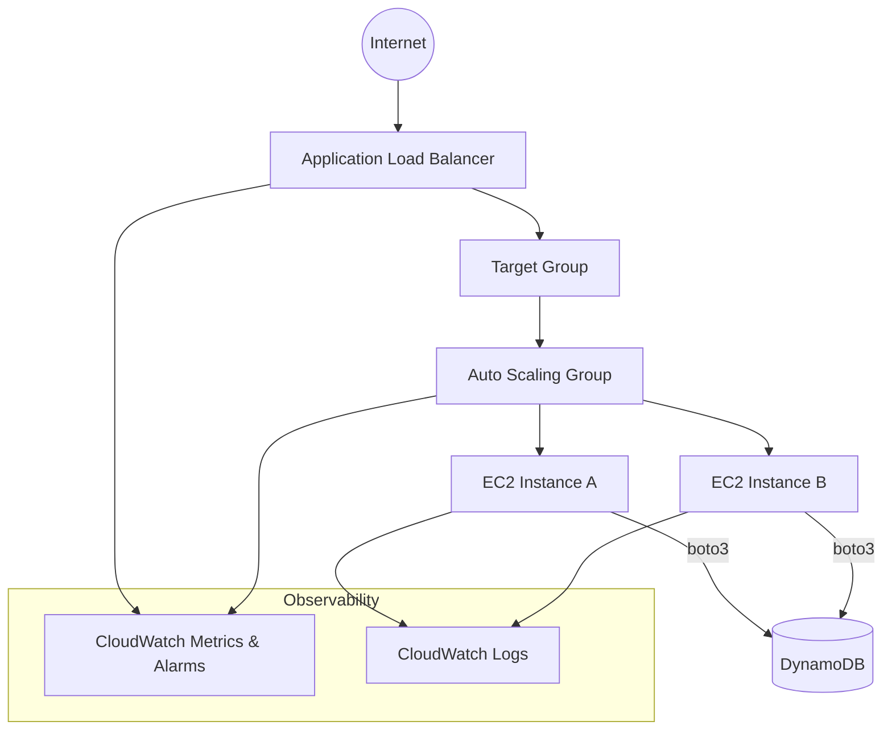
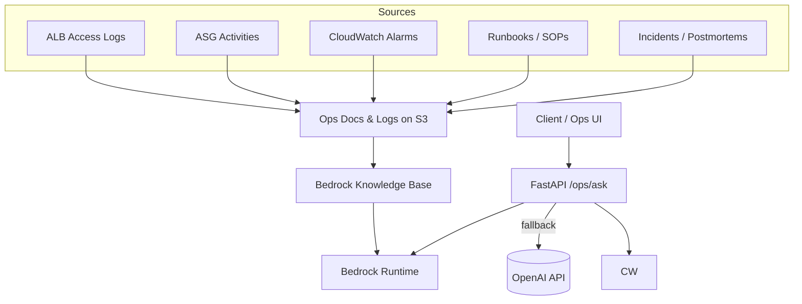

# Demo Architecture Overview

This document outlines a practical, simple, and production-friendly architecture for the Course Management demo with AWS ALB + ASG + DynamoDB, plus an optional RAG extension using Amazon Bedrock Knowledge Bases.

## Core App Stack (FastAPI + ALB + ASG + DynamoDB)



Key points
- ALB distributes traffic across healthy EC2 instances in the ASG.
- ASG uses warm pools and target tracking to scale quickly and safely.
- EC2 runs FastAPI (systemd) with minimal bootstrap; AMIs are prebaked with Packer.
- CloudWatch collects metrics (CPU, RequestCountPerTarget, health) and triggers scale actions.
- DynamoDB stores courses/students/enrollments.

## CI/CD Flow

```mermaid
flowchart LR
    Dev[Developer] -->|git push/PR| GH[GitHub Actions]
    GH --> Test[Tests & Quality (pytest/flake8/black/mypy)]
    Test --> Build[Build & Push Docker to ECR]
    Build --> TF[Terraform Plan & Apply]
    TF --> ASGRefresh[ASG Instance Refresh]
    ASGRefresh --> ALB
```

Key points
- GitHub Actions runs tests, builds images, applies Terraform, then triggers ASG refresh.
- Health checks validate deployment via `/health` endpoint.

## Optional RAG Extension (Amazon Bedrock Knowledge Bases)



Key points
- Upload ops documents/logs to S3; KB indexes and provides retrieval.
- FastAPI `/ops/ask` calls Bedrock retrieve-and-generate; returns answer + provenance.
- Fallback to OpenAI is available if Bedrock isn’t enabled.

## Deployment Parameters (Recommended Defaults)

- ASG size: `min=2`, `desired=2`, `max=10` (t3.micro/t3.small for demo)
- Health checks: ALB HTTP `/health`, interval 15–30s
- Instance warmup: 60–120s (shorter with warm pools + prebaked AMI)
- Alarms: `CPUUtilization` and `ALBRequestCountPerTarget`, `period=60`, `evaluationPeriods=1`
- Packer prebaked AMI: include Python deps, app code, systemd unit, CloudWatch agent

## RAG Data Shape (Simple & Effective)

- Logs/metrics: JSONL (`timestamp`, `component`, `env`, `region`, `message`, `fields...`)
- Runbooks/FAQs: Markdown split by headings for chunking
- Naming: `s3://<bucket>/bedrock/{logs|docs}/<type>/<YYYYMMDD>/...`
- Security: redact sensitive fields; scope IAM to required prefixes only

## Try It

- Upload docs: `python scripts/upload_to_s3_for_bedrock.py --bucket <bucket> --prefix bedrock/docs data/*.md`
- Set env: `USE_BEDROCK=true`, `BEDROCK_KB_ID=<kb-id>`
- Start app: `uvicorn app.main:app --reload`
- Ask: `POST /ops/ask { "query": "Why did ASG scale at 3PM?" }`

## Notes
- Keep demo small: a few days of logs + 1–2 runbooks is enough.
- Prefer simple, consistent formats for reliable retrieval.
- Validate scaling and health via `/health` and CloudWatch while running Locust or `/cpu-burn`.